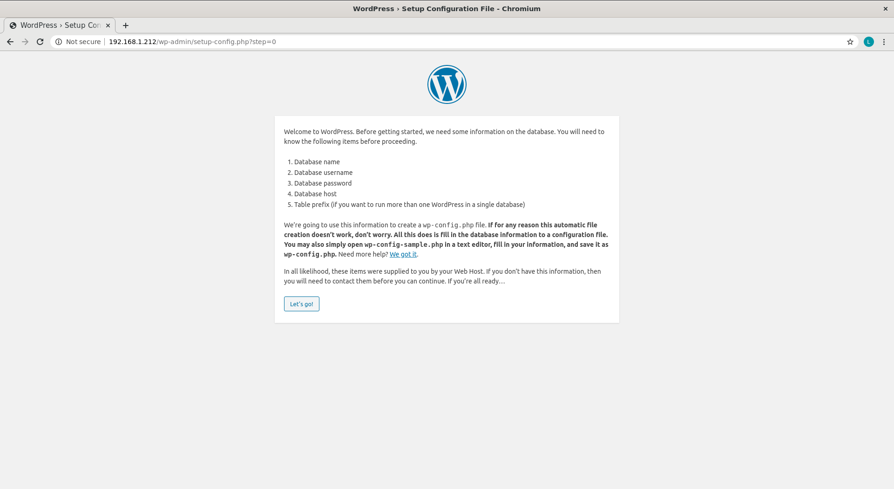

# Install wordpress on a centos system
Final wordpress site should be available on the public-facing network interface
and accessible through a browser, see picture below:

## Intstall all requirements:

- Follow the steps in [Installation steps](installation/steps.md)

## Apply config: 

- Follow instructions in [Apache Config](installation/config.md)
